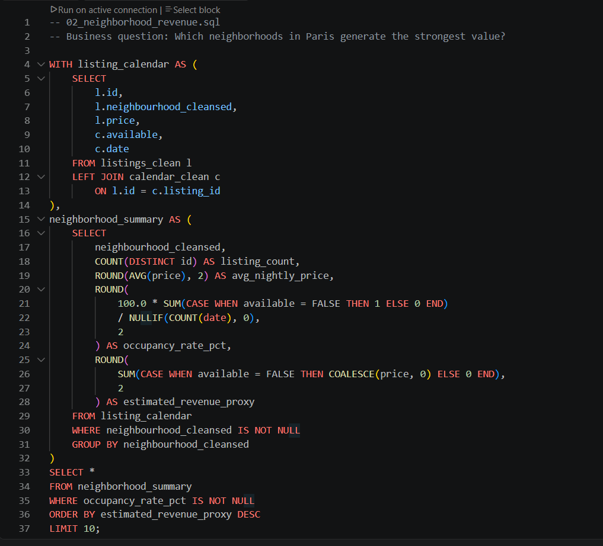
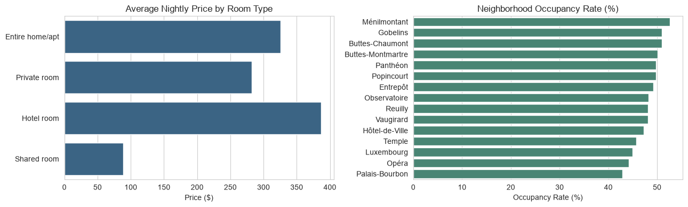
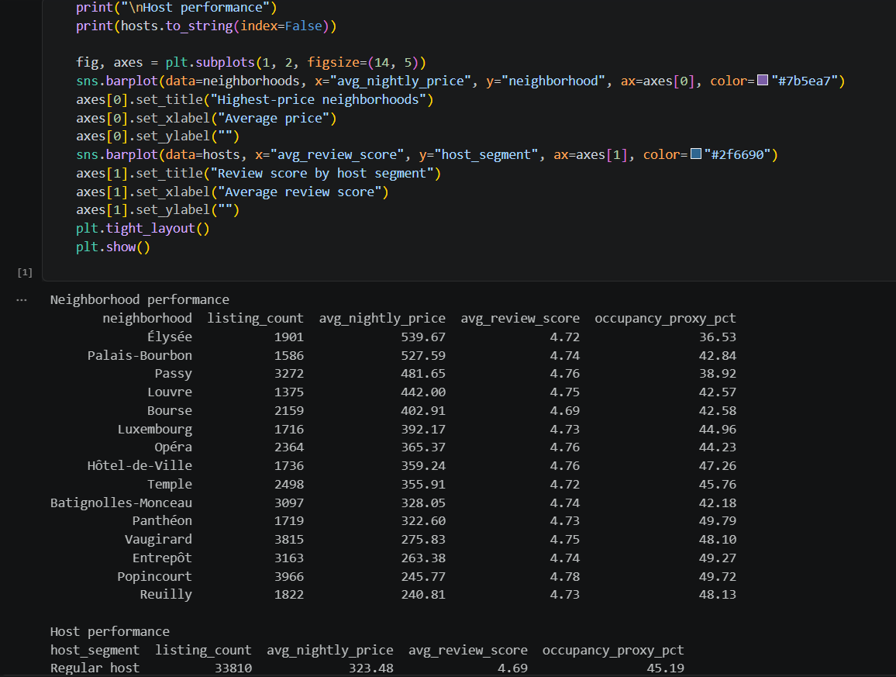
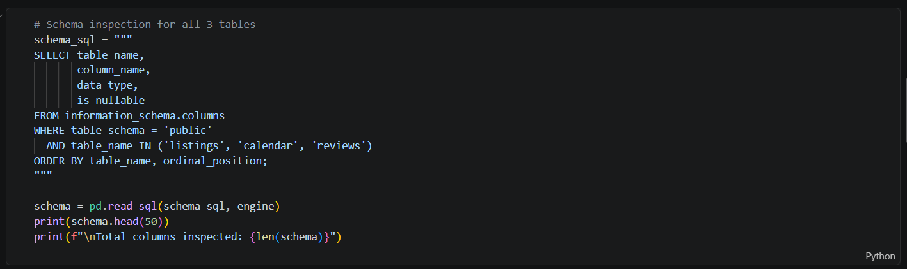
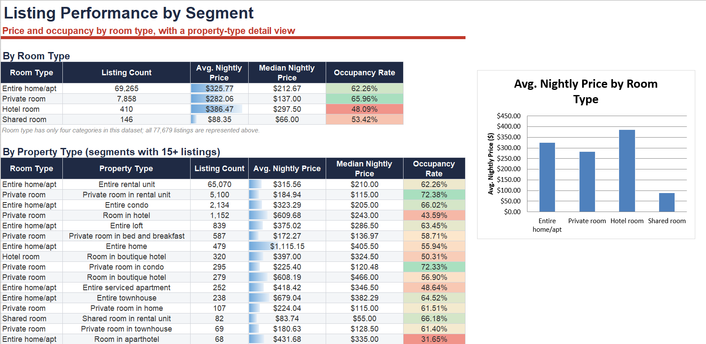
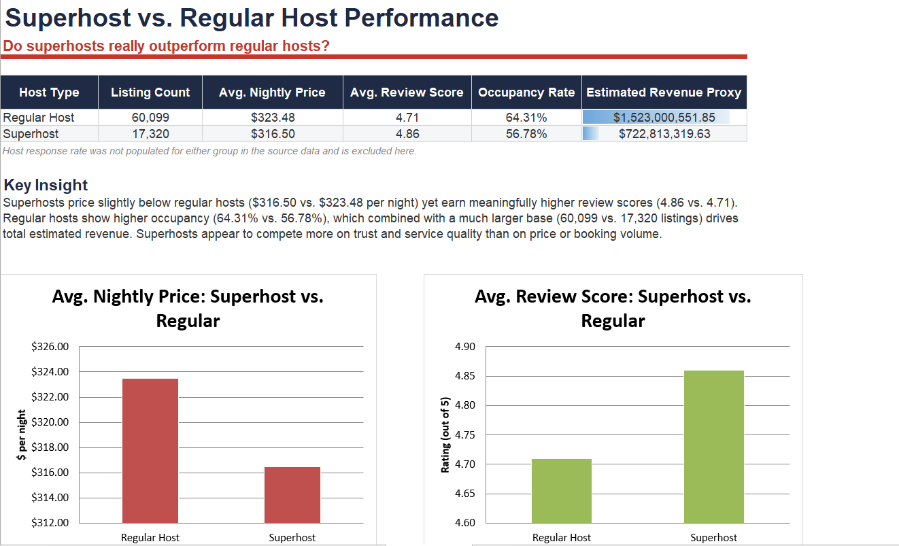
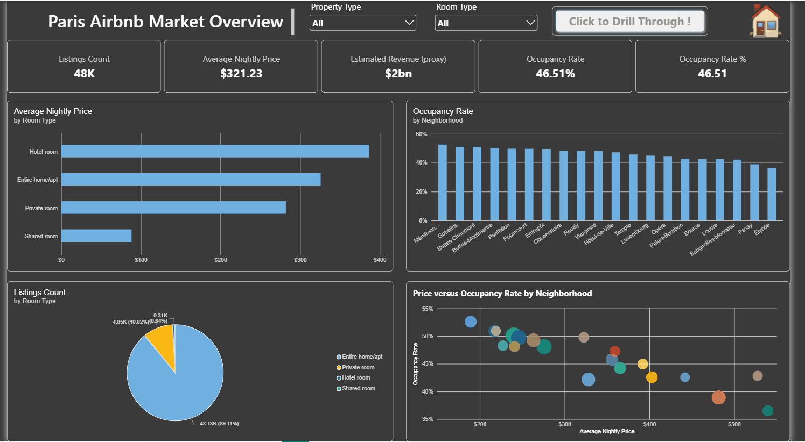

# 🏠 Paris Airbnb Market Analysis

An end-to-end analysis of the Paris Airbnb market, built from raw CSV files through PostgreSQL, Python, Excel, and Power BI.

The project answers one practical question:

> **How do location, nightly price, occupancy, listing characteristics, host status, and guest review quality shape Airbnb performance in Paris?**

The work is designed to be easy to follow for a business reader while remaining reproducible for another analyst.

---

## 🧭 Project Overview

The project follows one connected path from raw data to business recommendations:

```text
Raw CSV files
     ↓
PostgreSQL loading and cleaning
     ↓
SQL business analysis
     ↓
Python validation and exploration
     ↓
Excel reporting workbook
     ↓
Power BI interactive dashboard
```

### 🧩 What is in the data?

- `listings.csv`: one row per Airbnb listing, including price, room type, property type, host status, capacity, location, and review scores.
- `calendar.csv`: daily availability records for listings.
- `reviews.csv`: review-level records retained for validation and data-model documentation.

### 🎯 Who can use this project?

- **Investors:** compare neighborhood demand, pricing, and revenue potential.
- **Hosts:** understand which listing characteristics are linked with stronger performance.
- **Travelers:** compare price, location, property type, occupancy, and quality.
- **Analysts:** trace each dashboard metric back to SQL and Python logic.

---

## 📌 Main Findings

- The full cleaned listing dataset contains **77,679 listings**.
- The Python market overview uses the **48,402 listings with a valid positive price**, giving an average nightly price of **321.23** and a median of **205.50**.
- Entire homes and apartments are the largest room-type segment, with **43,131 price-valid listings** in the Python analysis.
- Hotel rooms have the highest average nightly price among room types at **386.47**. Shared rooms are the lowest-price segment at **88.35**.
- Larger properties command a premium: seven-bedroom entire homes average approximately **3,447.00** per night, compared with approximately **418.74** for two-bedroom entire homes.
- Superhosts show a higher average review score than regular hosts: **4.86 versus 4.69**.
- Superhosts also show a higher listing-level occupancy proxy: **49.91% versus 45.19%** for regular hosts.
- Strong occupancy is not limited to the most expensive neighborhoods. Ménilmontant, Gobelins, and Buttes-Chaumont appear among the stronger occupancy-proxy areas.

These are observed patterns and associations. They are not proof that price, neighborhood, or superhost status alone causes better performance.

> ⚠️ **Scope reminder:** Some Excel and SQL outputs use the full listing population, while the Python market overview and Power BI export require a valid positive price. Always check the denominator before comparing percentages.

---

## 🧪 1. SQL: Build the Evidence

SQL is the foundation of the project. It cleans the raw data and answers the main business questions with explicit, repeatable calculations.

### 🧹 Cleaning and data preparation

File: [01_data_cleaning.sql](queries/01_data_cleaning.sql)

This script:

- creates `listings_clean`, `calendar_clean`, and `reviews_clean`
- converts prices, dates, IDs, and boolean-like values into usable types
- preserves the correct grain of each table
- checks row counts and important null values

<p align="center">
  
</p>

*The SQL layer keeps the business logic visible: the reader can see how listings join to calendar dates and how occupancy and revenue are calculated.*

### 📍 Neighborhood revenue analysis

File: [02_neighborhood_revenue.sql](queries/02_neighborhood_revenue.sql)

The query returns one row per neighborhood with:

- listing count
- average nightly price
- occupancy rate
- estimated revenue proxy

**Business meaning:** a neighborhood should not be judged by price alone. The useful comparison is the balance between price, demand, and available supply.

### 🏘️ Listing performance analysis

File: [03_listing_performance.sql](queries/03_listing_performance.sql)

This compares `room_type` and `property_type` combinations using:

- listing count
- average nightly price
- average review score
- occupancy rate
- revenue per listing proxy

The query intentionally keeps a broader listing population, including listings with no usable price. That makes its denominator different from the Python price-valid analysis.

### ⭐ Host market analysis

File: [04_host_market_insights.sql](queries/04_host_market_insights.sql)

This compares superhosts and regular hosts across:

- listing volume
- average price
- review score
- response rate
- occupancy
- estimated revenue proxy

### 📤 Interactive Power BI export

File: [06_powerbi_listing_export.sql](queries/06_powerbi_listing_export.sql)

This produces one row per listing with listing attributes and calendar totals. It is the practical CSV source for the interactive Power BI report when the large PostgreSQL views are not convenient to load.

**Why one table?** Every slicer and visual reads the same table, so neighborhood, room type, property type, host segment, and price selections filter the report together without relationship problems.

---

## 🐍 2. Python: Explain the Patterns

The Python notebooks use compact PostgreSQL aggregations instead of loading the entire calendar table into pandas. They are designed to explain the market, not duplicate the full dashboard.

### ✅ Data verification

Notebook: [00_data_verification.ipynb](notebooks/00_data_verification.ipynb)

Checks include table counts, column types, duplicate keys, null rates, suspicious values, calendar coverage, and review fields.

### 📊 Market overview

Notebook: [01_market_overview.ipynb](notebooks/01_market_overview.ipynb)

The notebook shows the price-valid market population, room-type pricing, review quality, and neighborhood occupancy proxy.

<p align="center">
  
</p>

*The left chart compares average nightly price by room type. The right chart compares the listing-level occupancy proxy across neighborhoods.*

**Main takeaway:** hotel rooms have the highest average nightly price, while several moderately priced neighborhoods show stronger occupancy proxy values than premium areas.

### 🛏️ Pricing and listing characteristics

Notebook: [02_pricing_and_amenities.ipynb](notebooks/02_pricing_and_amenities.ipynb)

Despite its historical filename, this notebook does **not** analyze amenities. It analyzes:

- room type
- bedroom count
- guest capacity
- average nightly price
- listing volume

<p align="center">
  
</p>

**Main takeaway:** capacity and bedroom count are associated with higher nightly prices, but small premium segments should be treated carefully because a few listings can strongly influence their averages.

### 🏙️ Neighborhood and host analysis

Notebook: [03_neighborhood_and_host_analysis.ipynb](notebooks/03_neighborhood_and_host_analysis.ipynb)

This notebook compares neighborhood pricing, listing volume, occupancy proxy, host segment pricing, review quality, and occupancy proxy.

<p align="center">
  
</p>

**Main takeaway:** host quality and neighborhood context are useful comparison dimensions, but neither should be treated as a guaranteed cause of higher performance.

---

## 📗 3. Excel: Make the Results Easy to Read

Workbook: [Airbnb_Paris.xlsx](excel/Airbnb_Paris.xlsx)

Excel is the practical reporting layer. It turns the SQL results into clean tables, comparisons, notes, and supporting charts that can be shared quickly.

<p align="center">
  
</p>

**What this view shows:** room types and property types are compared using listing count, average price, median price, and occupancy. The minimum sample-size rule helps prevent rare property types from appearing as misleading winners.

<p align="center">
  
</p>

**Important Excel note:** the broader SQL listing-performance table can include listings without a usable price, while the Python market overview filters to positive prices. Different denominators can produce different percentages. This is a scope difference, not automatically a data error.

---

## 📊 4. Power BI: Make the Dashboard Interactive

Report: [Paris_Airbnb_Dashboard.pbix](powerbi/Paris_Airbnb_Dashboard.pbix)

The report has three pages:

1. **Introduction:** project purpose and navigation buttons.
2. **Main Dashboard:** four KPI cards and four market charts.
3. **Neighborhood Drill-Through:** detailed analysis of the selected neighborhood.

<p align="center">
  
</p>

### Main dashboard visuals

- average nightly price by room type
- occupancy rate by neighborhood
- listing mix by room type
- price versus occupancy by neighborhood

### Drill-through visuals

- property type versus nightly price
- room type versus nightly price
- host segment performance
- property type price versus review score

**Dashboard takeaway:** the report helps the reader move from the whole Paris market to one neighborhood without losing the context of price, occupancy, supply, or quality.

---

## 🧠 What the Metrics Mean

### Occupancy rate

```text
unavailable calendar days ÷ total calendar days
```

SQL outputs may show this as `62.54`. The Power BI export stores it as `0.6254` so Power BI can format it as `62.54%`.

The Python notebooks may use `availability_365` as a listing-level occupancy proxy. This is not identical to a calendar-weighted rate.

### Estimated revenue proxy

```text
unavailable or booked calendar days × nightly price
```

This is a comparison metric, not confirmed Airbnb revenue. It does not include fees, taxes, discounts, cancellations, or actual booking prices.

### Review quality

The main dashboard uses listing-level review scores from the listings data. The review table is retained for validation and documentation, but calendar and review facts are not joined directly because that could multiply rows and distort metrics.

---

## 💡 Recommendations

- Compare neighborhoods using both occupancy and price, not price alone.
- Treat superhost results as associations rather than guaranteed causal advantages.
- Use minimum sample sizes when comparing rare property types.
- Treat the revenue proxy as directional and comparative, never as official revenue.
- Keep the Excel scope note visible when comparing SQL and Python percentages.
- Refresh the Power BI CSV only when the source data is intentionally updated.

---

## 🏁 Conclusion

Paris Airbnb performance is not explained by one number. The strongest comparison comes from looking at **location, price, occupancy, listing characteristics, host status, and guest quality together**.

The project turns those comparisons into one connected workflow: SQL provides the evidence, Python explains the patterns, Excel organizes the reporting, and Power BI makes the result interactive.

---

## 🛠️ Reproduce the Project

1. Install dependencies from [requirements.txt](requirements.txt).
2. Configure PostgreSQL credentials in `.env` without publishing the file.
3. Load the raw CSVs with `load_csvs.py`.
4. Run [00_data_verification.ipynb](notebooks/00_data_verification.ipynb).
5. Run [01_data_cleaning.sql](queries/01_data_cleaning.sql) after confirming the raw tables are correct.
6. Run the business SQL files in the `queries` folder.
7. Run the Python notebooks for compact exploratory outputs.
8. Review [Airbnb_Paris.xlsx](excel/Airbnb_Paris.xlsx).
9. Open [Paris_Airbnb_Dashboard.pbix](powerbi/Paris_Airbnb_Dashboard.pbix) for the final interactive report.

## 🗂️ Repository Structure

```text
data/raw/          Raw listings, calendar, and reviews CSVs
queries/           Cleaning, business analysis, and Power BI export SQL
notebooks/         Verification and explanatory Python analysis
excel/             Airbnb_Paris.xlsx reporting workbook
powerbi/           Paris_Airbnb_Dashboard.pbix and dashboard notes
project_media/     SQL, Python, Excel, and Power BI evidence images
docs/              Story map and project logic reference
```

## ✅ Project Status

- ✅ PostgreSQL cleaning
- ✅ SQL business analysis
- ✅ Python verification and exploration
- ✅ Excel reporting workbook
- ✅ Power BI dashboard
- ✅ Evidence screenshots and dashboard animation
- ✅ Documentation and reproducibility notes
